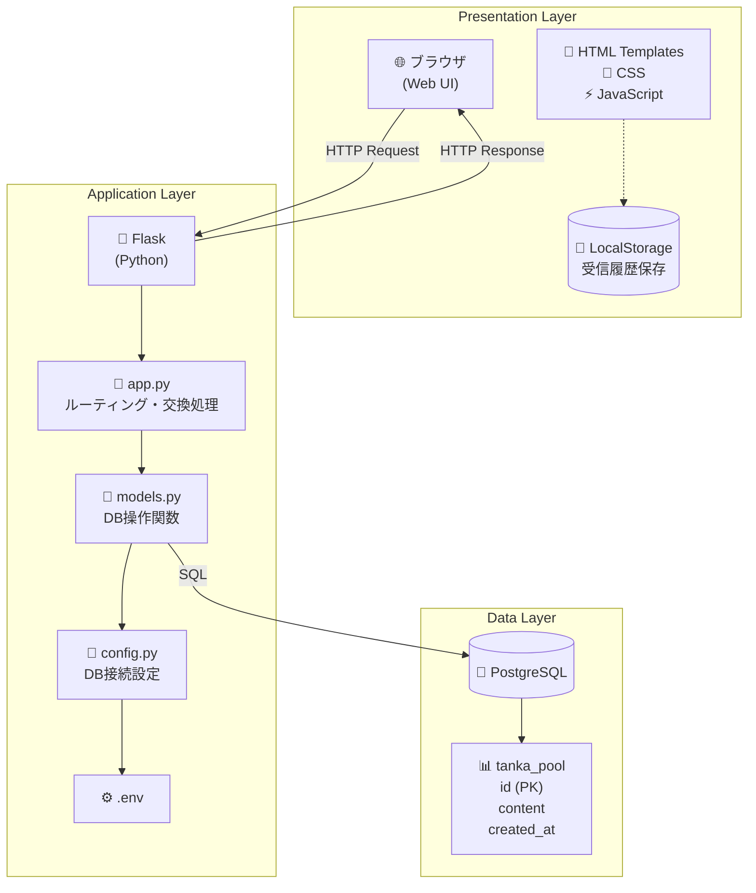
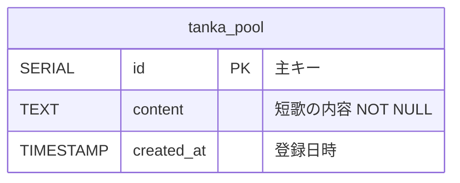

# 匿名短歌交換

匿名で短歌を投稿し、他の誰かの短歌と交換するWebアプリケーションです。

##  概要

- ユーザーは匿名で利用可能
- 短歌を投稿すると、DBから他ユーザーの短歌をランダムに1件受け取る
- 受け取った短歌はDBから削除される
- 投稿した短歌はDBに保存される
- 「INSERT 1件 + DELETE 1件」でDB内短歌総量は常に一定

##  アーキテクチャ

Web 3層構造:
- **Presentation Layer**: Web UI（HTML/CSS/JavaScript）
- **Application Layer**: Flask（Python）
- **Data Layer**: PostgreSQL

### システム構成図



### ER図



> **Note**: 匿名性を保つため、ユーザー情報は一切保存しません。受信履歴はブラウザのLocalStorageにのみ保存されます。

##  ファイル構成

```
tanka_exchange/
├── app.py              # メインFlaskアプリ
├── config.py           # DB接続設定
├── models.py           # DBモデル・操作関数
├── init_db.py          # DB初期化・ダミーデータ投入
├── requirements.txt    # Python依存パッケージ
├── .env                # 環境変数（DB接続情報）
├── docs/               # ドキュメント
│   ├── system_architecture.drawio  # システム構成図
│   └── er_diagram.pu               # ER図（PlantUML）
├── templates/          # HTMLテンプレート
│   ├── base.html       # 共通ベース
│   ├── home.html       # ホーム画面
│   ├── submit.html     # 短歌投稿画面
│   ├── result.html     # 交換結果画面
│   └── history.html    # 受信履歴画面
└── static/
    ├── css/
    │   └── style.css   # スタイルシート
    └── js/
        └── main.js     # LocalStorage処理
```

##  セットアップ

### 前提条件

- **Python 3.7以上**
- **Docker Desktop** ([インストールはこちら](https://www.docker.com/products/docker-desktop))

### 簡単セットアップ（推奨）

Docker Desktopをインストール済みの場合、以下のコマンドだけで起動できます:

```bash
# 1. 依存パッケージのインストール
pip install -r requirements.txt

# 2. アプリケーションを起動（Docker自動起動 + DB自動初期化）
python app.py
```

アプリが自動的に以下を実行します:
- ✅ Dockerコンテナの起動確認と自動起動
- ✅ データベース接続の確認
- ✅ データベースの初期化（初回のみ）

ブラウザで http://localhost:5000 にアクセス

### デスクトップアプリとして起動

ブラウザではなく、専用のデスクトップウィンドウで起動することもできます:

```bash
# 1. 依存パッケージのインストール（初回のみ）
pip install -r requirements.txt

# 2. デスクトップアプリとして起動
python desktop_app.py
```

デスクトップウィンドウが自動的に開きます。ブラウザは不要です。

---

### 手動セットアップ（従来の方法）

#### 1. 依存パッケージのインストール

```bash
pip install -r requirements.txt
```

#### 2. PostgreSQLの設定

**Option A: Docker使用（推奨）**

```bash
# PostgreSQLコンテナを起動
docker-compose up -d
```

**Option B: ローカルPostgreSQL**

1. PostgreSQLをインストール
2. データベースとユーザーを作成:

```sql
CREATE DATABASE tanka_db;
CREATE USER tanka_user WITH PASSWORD 'password';
GRANT ALL PRIVILEGES ON DATABASE tanka_db TO tanka_user;
```

#### 3. 環境変数の設定

`.env`ファイルを編集して、DB接続情報を設定:

```
DB_HOST=localhost
DB_PORT=5432
DB_NAME=tanka_db
DB_USER=tanka_user
DB_PASSWORD=password
```

#### 4. データベースの初期化

```bash
python init_db.py
```

#### 5. アプリケーションの起動

```bash
python app.py
```

ブラウザで http://localhost:5000 にアクセス

##  画面構成

| 画面 | URL | 説明 |
|------|-----|------|
| ホーム画面 | `/` | 「短歌を交換する」「受け取った短歌を見る」ボタン |
| 短歌投稿画面 | `/submit` | 5行入力フォーム、投稿ボタン |
| 交換結果画面 | `POST /exchange` | 受け取った短歌を表示、LocalStorageに自動保存 |
| 受信履歴画面 | `/history` | ローカル保存された短歌のみ表示 |

##  DB設計

### tanka_pool テーブル

| カラム | 型 | 説明 |
|--------|------|------|
| id | SERIAL | 主キー |
| content | TEXT NOT NULL | 短歌の内容 |
| created_at | TIMESTAMP | 登録日時 |

### 必須SQL

```sql
-- ランダム取得
SELECT id, content FROM tanka_pool ORDER BY RANDOM() LIMIT 1;

-- 削除
DELETE FROM tanka_pool WHERE id = :id;

-- 登録
INSERT INTO tanka_pool(content) VALUES(:content);
```

##  プライバシー

- ログイン機能なし
- ユーザー特定情報は保存しない
- 受信履歴はブラウザのLocalStorageに保存（サーバーには保存しない）
