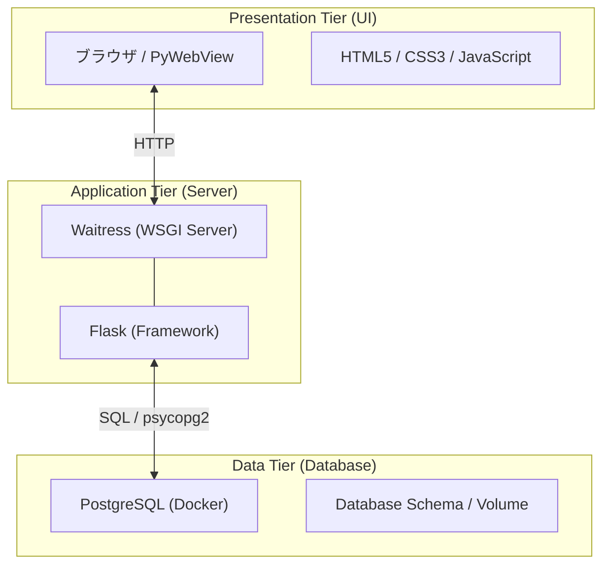

# 匿名短歌交換アプリ (Tanka Exchange)

匿名で短歌を投稿し、他の誰かの短歌と交換する「Web3 層構造」を採用したフルスタック Web アプリケーションです。

## 🌟 概要

- **匿名性**: ユーザー登録不要。session_id による一意の識別のみ行います。
- **一期一会**: 短歌を投稿すると、DB 内の誰かの短歌をランダムに 1 件受け取ります。
- **データ不変性**: 「INSERT 1 件 + DELETE 1 件」のアルゴリズムにより、DB 内の短歌総量が一定に保たれます。
- **デスクトップ対応**: ブラウザだけでなく、デスクトップアプリ（ウィンドウ）としても起動可能です。

## 🏗️ アーキテクチャ

システムは以下の **Web 3 層構造** で構成されています。



詳細な解説資料は [docs/](./docs/) フォルダ内にあります。

## 📁 フォルダ・ファイル構成

```text
family_fishing_project/
├── server.py           # Webサーバー起動スクリプト (Waitress使用)
├── desktop_app.py      # デスクトップアプリ起動スクリプト (PyWebView使用)
├── requirements.txt    # 依存パッケージ
├── docker-compose.yml  # DB環境定義
├── .env                # 環境変数
├── app/                # アプリケーションロジック
│   ├── main.py         # Flaskルーティング・自動セットアップ
│   ├── models.py       # SQL操作 (JOIN, SubQuery, etc.)
│   ├── config.py       # DB接続設定
│   ├── static/         # 静的ファイル (CSS/JS)
│   └── templates/      # Jinja2 テンプレート
├── scripts/            # ユーティリティ
│   ├── init_db.py      # DB初期化・ダミーデータ投入
│   └── migrate_db.py   # スキーマ移行スクリプト
└── docs/               # 技術解説ドキュメント (Markdown)
    ├── SYSTEM_DIAGRAMS.md          # 構成図・ER図・シーケンス図
    ├── DATABASE_TECHNICAL_REPORT.md # データベース技術仕様書
    ├── WEB_3_TIER_ARCHITECTURE.md   # Web3層構造解説
    └── PRESENTATION_GUIDE.md        # プレゼン用技術解説
```

## 🚀 セットアップと起動方法

### 前提条件

- **Python 3.10+**
- **Docker Desktop** (PostgreSQL の動作に必要)

### 1. 依存パッケージのインストール

```bash
pip install -r requirements.txt
```

### 2. 環境変数の設定 (初回のみ)

リポジトリにはセキュリティのため設定ファイルの見本のみが含まれています。以下のコマンドで設定ファイルを作成してください：

```bash
# Windows
copy .env.example .env

# macOS / Linux
cp .env.example .env
```

※ Docker を使用する場合、デフォルト設定のままで動作します。

### 3. アプリケーションの起動

用途に合わせて 2 通りの起動方法があります。いずれの方法でも、**DB の起動(Docker)とテーブル初期化は自動で行われます。**

#### A. Web サーバーとして起動（ブラウザで使用）

```bash
python server.py
```

起動後、ブラウザで [http://localhost:5000](http://localhost:5000) にアクセスしてください。

#### B. デスクトップアプリとして起動（専用ウィンドウで使用）

```bash
python desktop_app.py
```

専用のアプリケーションウィンドウが立ち上がります。

## 📚 関連ドキュメント

より詳細な技術情報は、以下のドキュメントを参照してください：

- [システム設計図面集 (構成図/ER 図/シーケンス図)](./docs/SYSTEM_DIAGRAMS.md)
- [データベース技術仕様書 (トランザクション/結合/制約)](./docs/DATABASE_TECHNICAL_REPORT.md)
- [Web3 層構造の解説](./docs/WEB_3_TIER_ARCHITECTURE.md)
- [Waitress への移行のまとめ](./docs/WAITRESS_IMPLEMENTATION_SUMMARY.md)
- [プレゼンテーション用技術解説資料](./docs/PRESENTATION_GUIDE.md)

## 🛠️ 将来の拡張性

本アプリは疎結合な 3 層構造を採用しているため、以下の拡張が容易です：

- フロントエンドのモバイルアプリ化（React Native 等）
- データ層のクラウドマネージド DB（AWS RDS 等）への切り替え
- アプリケーションサーバーの水平スケーリング

---

University Database Management Project - 2026
