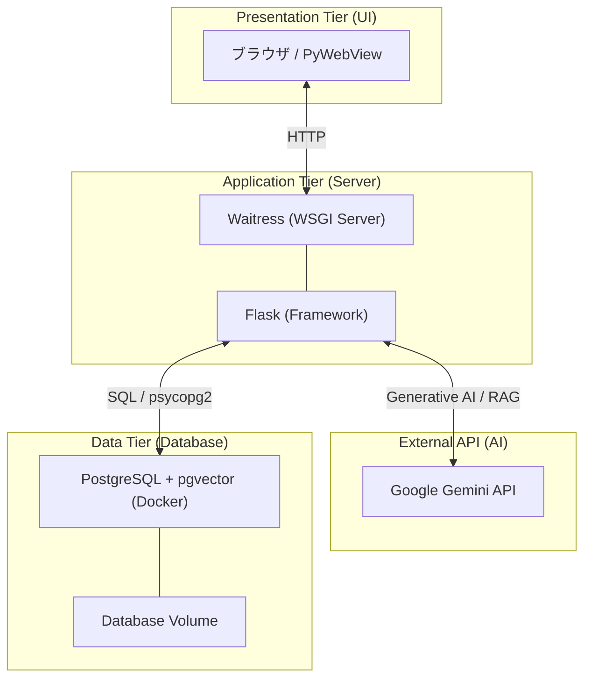
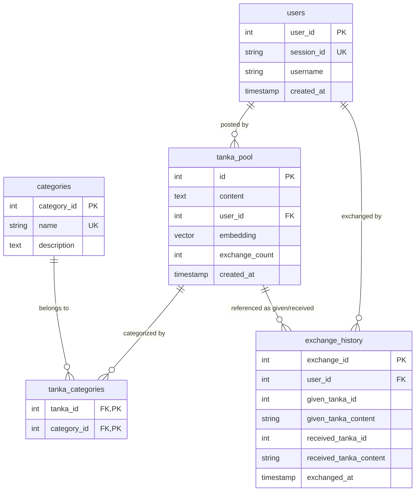

# プレゼン資料

[ファミリーフィッシング.pdf](https://github.com/user-attachments/files/24697180/default.pdf)


# 匿名短歌交換アプリ (Tanka Exchange)

匿名で短歌を投稿し、他の誰かの短歌と交換する Web 3 層構造を採用したフルスタック Web アプリケーションです。

## 概要

- **匿名性**: ユーザー登録不要。session_id による一意の識別のみ行います。
- **一期一会**: 短歌を投稿すると、DB 内の自分以外の短歌をランダムに 1 件受け取ります。
- **データ不変性**: INSERT 1 件 + DELETE 1 件のアルゴリズムにより、DB 内の短歌総量が一定に保たれます。
- **AI 歌人 (RAG 強化版)**: Google Gemini API と PostgreSQL (pgvector) を連携させ、データベース内の短歌を意味ベースで検索（ベクトル探索）して回答する RAG 構成を実装しています。
- **デスクトップ対応**: ブラウザだけでなく、PyWebView を利用したデスクトップアプリとしても起動可能です。

## アーキテクチャ

システムは以下の Web 3 層構造で構成されています。



詳細な解説資料は docs/ フォルダ内にあります。

## データベース設計 (ER Diagram)

テーブル間のリレーションシップを示す実体関連図です。



## フォルダ・ファイル構成

```text
family_fishing_project/
├── server.py           # Webサーバー起動スクリプト (Waitress使用)
├── desktop_app.py      # デスクトップアプリ起動スクリプト (PyWebView使用)
├── requirements.txt    # 依存パッケージ
├── docker-compose.yml  # DB環境定義 (pgvectorイメージ使用)
├── .env                # 環境変数 (APIキー等)
├── app/                # アプリケーションロジック
│   ├── main.py         # Flaskルーティング・AI連携ロジック
│   ├── models.py       # SQL操作 (JOIN, SubQuery, Vector Search, etc.)
│   ├── config.py       # DB接続設定
│   ├── static/         # 静的ファイル (CSS/JS)
│   └── templates/      # Jinja2 テンプレート
├── scripts/            # ユーティリティ
│   ├── init_db.py      # DB初期化・ダミーデータ投入 (--reset 機能あり)
│   ├── update_embeddings.py # 既存短歌のベクトル(Embedding)生成・更新
│   ├── test_db.py      # 接続・環境テストスクリプト
│   └── tests/          # 各種テスト・デバッグスクリプト
└── docs/               # 技術解説ドキュメント
    ├── design/         # 構成図・ER図等
    ├── presentation/   # プレゼン用スライド・台本等
    └── technical/      # データベース技術詳細・レポート等
```

## セットアップと起動方法

### 前提条件

- **Python 3.10+**
- **Docker Desktop** (PostgreSQL + pgvector の動作に必要)

### 1. 依存パッケージのインストール

```bash
pip install -r requirements.txt
```

### 2. 環境変数の設定 (初回のみ)

.env.example をコピーして .env を作成し、GENAI_API_KEY を設定してください。

```bash
# Windows
copy .env.example .env

# macOS / Linux
cp .env.example .env
```

### 3. アプリケーションの起動

用途に合わせて 2 通りの起動方法があります。いずれの方法でも、DB の起動(Docker)とテーブル初期化は自動で行われます。

#### A. Web サーバーとして起動（ブラウザで使用）

```bash
python server.py
```

起動後、ブラウザで http://localhost:5000 にアクセスしてください。

#### B. デスクトップアプリとして起動（専用ウィンドウで使用）

```bash
python desktop_app.py
```

専用のアプリケーションウィンドウが立ち上がります。

### 4. データベース管理（任意）

- **完全初期化**: `python scripts/init_db.py --reset`
- **ベクトルデータの再生成**: `python scripts/update_embeddings.py`

## 関連ドキュメント

より詳細な技術情報は、以下のドキュメントを参照してください：

- [システム設計図面集 (構成図/ER 図/シーケンス図)](./docs/design/SYSTEM_DIAGRAMS.md)
- [データベース技術仕様書 (トランザクション/結合/制約)](./docs/technical/DATABASE_TECHNICAL_REPORT.md)
- [Web3 層構造の解説](./docs/design/WEB_3_TIER_ARCHITECTURE.md)
- [プレゼンテーション用・技術解説カンニングペーパー](./docs/presentation/PRESENTATION_FINAL_CHEAT_SHEET.md)

## AI 歌人（Gemini API 連携）とベクトル探索

本アプリは、Google Gemini API と PostgreSQL の pgvector 拡張を活用した RAG (Retrieval-Augmented Generation) 機能を搭載しています。

- **機能**: ユーザーのメッセージに対し、AI が共感しつつ、データベース内から「意味が近い短歌」を自動抽出して引用・解説します。
- **技術詳細**:
  - **Embedding**: `google-generativeai` を使用し、短歌とユーザー入力を 768 次元のベクトルに変換。
  - **ベクトル探索**: pgvector の `<=>` (コサイン距離) 演算子を用いて、DB 内部で高速なセマンティック検索を実行。
  - **モデル**: `gemini-flash-latest` を採用し、低遅延なレスポンスを実現。

---

University Database Management Project - 2026
