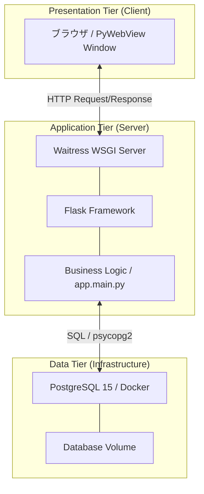
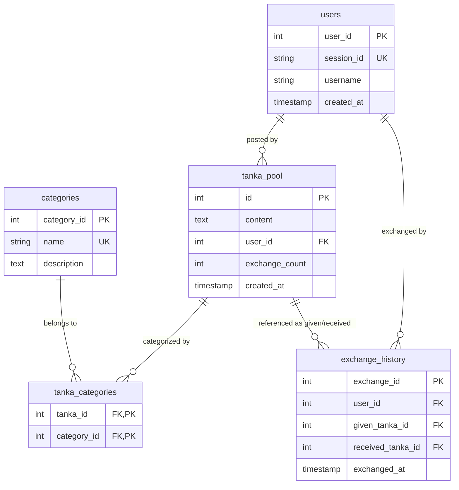
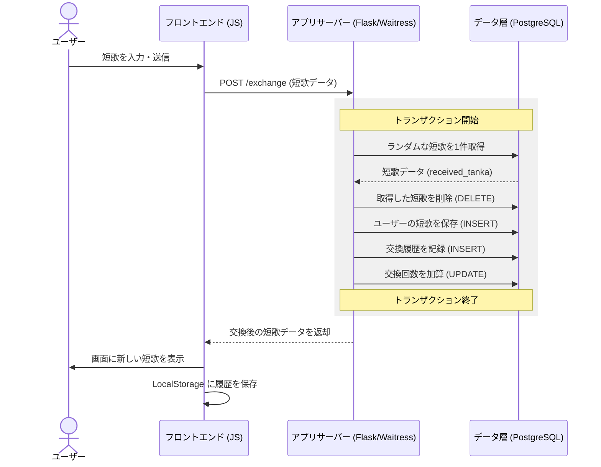
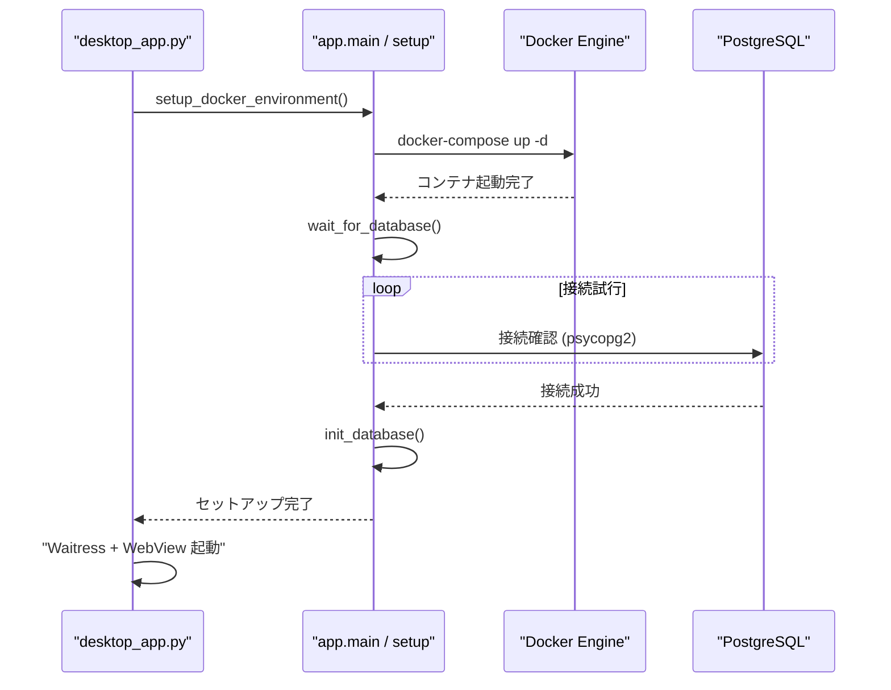

# システム設計図面集 (Mermaid)

プレゼンテーションやレポートにそのまま貼り付けて使用できる、最新のシステム構成図、ER 図、およびシーケンス図です。

---

## 1. システム構成図 (System Architecture)

Web 3 層構造に基づいた物理的なコンポーネントの配置図です。

---

## 2. 実体関連図 (ER Diagram)

データベースのテーブル構造と、外部キーによるリレーションシップを示します。

---

## 3. シーケンス図 (Sequence Diagram)

「短歌を投稿して交換する」という本アプリのメインフローの流れを示します。

---

## 4. 起動・初期化シーケンス

アプリ起動時の自動セットアップの流れです。

