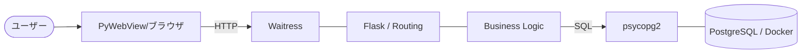

# システム技術詳細解説ガイド (Technical Deep Dive)

本アプリケーションで使用されている技術要素、アーキテクチャ、およびモジュール間の連携について、エンジニアリングの観点から深く掘り下げて解説します。

---

## 🏗️ 1. 全体アーキテクチャ：Web 3 層構造

本アプリは、スケーラビリティと保守性に優れた「Web 3 層構造」を採用しています。

1.  **プレゼンテーション層 (UI)**: ユーザーインターフェース。
2.  **アプリケーション層 (Logic)**: 業務ルールとリクエスト処理。
3.  **データ層 (Storage)**: 情報の永続化。

---

## 🎨 2. プレゼンテーション層 (Front-End)

### **PyWebView**

- **役割**: Web アプリをネイティブなデスクトップウィンドウとして表示するラッパー。
- **仕組み**: 内部で OS 標準のブラウザエンジン（Windows なら Edge/Webview2 など）を呼び出し、ローカルの Flask サーバーの URL（`http://127.0.0.1:5000`）を表示します。
- **メリット**: ブラウザを開く手間を省き、単体のアプリケーションとしてユーザーに提供できます。

### **Vanilla CSS / JavaScript (Jinja2)**

- **HTML**: Flask のテンプレートエンジン `Jinja2` を使用し、サーバーサイドでデータを動的に埋め込みます。
- **Modern JavaScript**: 「受信履歴」はサーバーの DB ではなく、ブラウザ側の `LocalStorage` に保存します。これにより、匿名性を維持しつつユーザーの利便性を高めています。

---

## ⚙️ 3. アプリケーション層 (Back-End)

### **Waitress (WSGI Server)**

- **役割**: Flask アプリを実行するための「本番用アプリケーションサーバー」。
- **詳細**: Python 標準の `WSGI` 規格に準拠。Flask 内蔵の開発用サーバーと違い、複数のリクエストを効率的に捌き、高い安定性を持ちます。
- **なぜ必要か**: セキュリティ面での強化と、マルチスレッド処理によるパフォーマンス向上のためです。

### **Flask (Framework)**

- **役割**: URL ルーティングとリクエストの振り分けを行う Web フレームワーク。
- **Business Logic**: 「短歌を投稿して、誰かのものと交換する」という本アプリの核となるロジックを管理します。

---

## 💾 4. データ層 (Data Stack)

### **PostgreSQL 15**

- **役割**: データの永続化を担うリレーショナルデータベース (RDBMS)。
- **特徴**: トランザクション処理に優れ、今回のような「削除と挿入を同時に行う」処理の整合性を保つのに最適です。

### **Docker / docker-compose**

- **役割**: データベース環境の「コンテナ化」と「インフラのコード化」。
- **詳細**: 開発者ごとに DB をインストールする手間を省き、`docker-compose up` だけで誰でも同じ環境を瞬時に構築できます。

### **psycopg2**

- **役割**: Python と PostgreSQL を接続するための「データベースアダプタ」。
- **詳細**: Python から `SQL` 文を発行し、その結果を取得するためのブリッジ（架け橋）として機能します。

---

## 🛠️ 5. 主要な仕組み：Business Logic & SQL

### **短歌交換のアルゴリズム (Transaction)**

1.  **ランダム抽出**: `ORDER BY RANDOM() LIMIT 1` を使用してプールから 1 件選ぶ。
2.  **データの削除**: 受け取った短歌を DB から削除（他者の重複取得を防止）。
3.  **データの挿入**: ユーザーが投稿した短歌を DB に新規保存。

- **ACID 特性**: これらの一連の動作を 1 つのトランザクションとして実行し、途中でエラーが起きたら全てキャンセル（ロールバック）することで、データが消えるのを防ぎます。

### **自動セットアップ機能 (Automation)**

- `subprocess` モジュールを使用し、Python から直接 `docker-compose` コマンドを制御します。
- コンテナが立ち上がるまでポーリング（接続試行）を行い、準備ができたら `SQL` でテーブルを作成・初期化します。

---

## 📈 6. まとめ：技術スタックの連携図

このシステムは、単一の技術に依存せず、各コンポーネントが役割（責任）を分担することで、変更に強く堅牢なシステムを実現しています。
