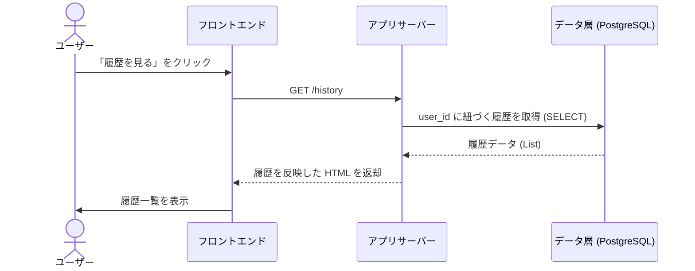
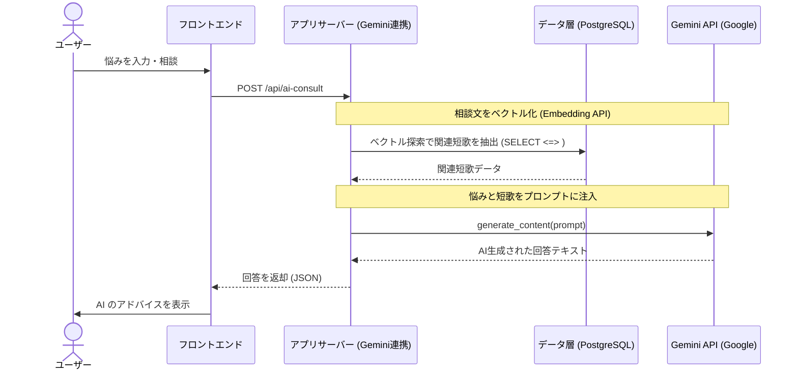
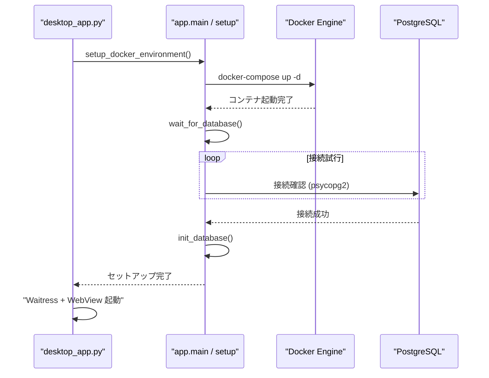

# システム設計図面集 (Mermaid)

プレゼンテーションやレポートにそのまま貼り付けて使用できる、最新のシステム構成図、ER 図、およびシーケンス図です。

---

## 1. システム構成図 (System Architecture)

Web 3 層構造に基づいた物理的なコンポーネントの配置図です。

````mermaid
graph TD
    subgraph "Presentation Tier (Client)"
        A["ブラウザ / PyWebView Window"]
    end

    subgraph "Application Tier (Server)"
        B["Waitress WSGI Server"]
        C["Flask Framework"]
        D["Business Logic / app.main.py"]
    end

    subgraph "External API (AI)"
        G["Google Gemini API<br>(gemini-2.0-flash)"]
    end

    subgraph "Data Tier (Infrastructure)"
        E["PostgreSQL + pgvector / Docker"]
        F["Database Volume"]
    end

    A <-->|HTTP Request/Response| B
    B --- C
    C --- D
    D <-->|SQL / psycopg2| E
    D <-->|API Key / JSON| G
    E --- F

---

## 2. 【未来の展望】MCP 統合アーキテクチャ (Future Architecture with MCP)

本プロジェクトの拡張構想である「MCP (Model Context Protocol)」を導入した構成図です。

```mermaid
graph TD
    subgraph "Presentation Tier"
        A["ブラウザ"]
    end

    subgraph "Application Tier"
        B["Flask / Waitress"]
    end

    subgraph "Data & Tool Tier"
        E[("PostgreSQL")]
        H["MCP Server<br>(DB Connector)"]
    end

    subgraph "AI Core"
        G["LLM (Gemini/Claude)"]
    end

    A <--> B
    B <--> G
    G <-->|MCP Protocol| H
    H <-->|SQL Query| E
````

> [!NOTE] > **現在のプロトタイプとの違い**:
> 現在は Flask が直接 DB と AI を仲介していますが、将来的に **MCP Server** を独立させることで、AI 自身が自律的に DB から必要な短歌を検索・収集できるようになります。

````

---

## 3. 実体関連図 (ER Diagram)

データベースのテーブル構造と、外部キーによるリレーションシップを示します。

```mermaid
erDiagram
    users ||--o{ tanka_pool : "posted by"
    users ||--o{ exchange_history : "exchanged by"
    tanka_pool ||--o{ tanka_categories : "categorized by"
    categories ||--o{ tanka_categories : "belongs to"
    tanka_pool ||--o{ exchange_history : "referenced as given/received"

    users {
        int user_id PK
        string session_id UK
        string username
        timestamp created_at
    }

    tanka_pool {
        int id PK
        text content
        int user_id FK
        vector embedding
        int exchange_count
        timestamp created_at
    }

    categories {
        int category_id PK
        string name UK
        text description
    }

    tanka_categories {
        int tanka_id FK, PK
        int category_id FK, PK
    }

    exchange_history {
        int exchange_id PK
        int user_id FK
        int given_tanka_id
        string given_tanka_content
        int received_tanka_id
        string received_tanka_content
        timestamp exchanged_at
    }
````

---

## 4. 短歌交換シーケンス (Main Flow)

「短歌を投稿して交換する」という本アプリのメインフローの流れを示します。

````mermaid
sequenceDiagram
    actor User as ユーザー
    participant Front as フロントエンド (JS)
    participant Server as アプリサーバー (Flask/Waitress)
    participant DB as データ層 (PostgreSQL)

    User->>Front: 短歌を入力・送信
    Front->>Server: POST /exchange (短歌データ)

    rect rgb(240, 240, 240)
        Note over Server, DB: トランザクション開始
        Server->>DB: ランダムな短歌を1件取得
        DB-->>Server: 短歌データ (received_tanka)
        Server->>DB: 取得した短歌を削除 (DELETE)

        Note over Server, AI: 投稿された短歌をベクトル化 (Embedding)
        Server->>AI: generate_embeddings(tanka)

        Server->>DB: ユーザーの短歌とベクトルを保存 (INSERT)
        Server->>DB: 交換履歴を記録 (INSERT)
        Server->>DB: 交換回数を加算 (UPDATE)
        Note over Server, DB: トランザクション終了
    end

    Server-->>Front: 交換後の短歌データを返却
    Front->>User: 画面に新しい短歌を表示
```

---

## 5. 履歴表示シーケンス (History View Flow)

過去に受け取った短歌をデータベースから取得して表示する流れです。



---

## 6. AI 歌人相談シーケンス (AI Advisor Flow)

AI 歌人がデータベースを参照（RAG：検索拡張生成）して回答を生成する流れです。



---

## 7. 起動・初期化シーケンス

アプリ起動時の自動セットアップの流れです。


````
