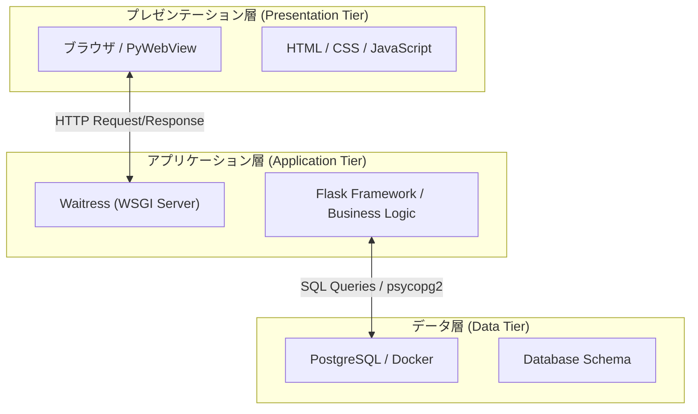

# Web3 層構造解説書

本アプリケーション（匿名短歌交換アプリ）における「Web3 層構造」の具体的な構成について解説します。

---

## 🏗️ 全体構造図

---

## 1. プレゼンテーション層 (Presentation Tier)

ユーザーが直接触れるフロントエンド部分です。

- **役割**: データの表示とユーザー入力の受け付け。
- **技術要素**:
  - **HTML (Jinja2)**: ページの構造定義。
  - **Vanilla CSS**: デザインとレイアウトの装飾。
  - **JavaScript**: ブラウザ上での動的な処理（受信履歴の保存など）。
  - **PyWebView**: デスクトップアプリ版では、このプレゼンテーション層をネイティブウィンドウとしてラップしています。

## 2. アプリケーション層 (Application Tier)

システムの中心となるロジックを処理するバックエンド部分です。

- **役割**: ユーザーからの命令を処理し、データ層と通信して結果をプレゼンテーション層に返します。
- **技術要素**:
  - **Waitress (WSGI Server)**: 本番環境デプロイ可能な純 Python 製のアプリケーションサーバー。
  - **Flask (Framework)**: Web アプリケーションフレームワーク。ルーティングやセッション管理を担当。
  - **ロジック実装**: 短歌の交換処理、カテゴリ別の統計計算、ランダムな 1 件の抽出アルゴリズムなど。
  - **psycopg2**: データベースアダプタとしてデータ層との橋渡しをします。

## 3. データ層 (Data Tier)

情報の保存と管理を専門に行う部分です。

- **役割**: データの永続化。アプリケーション層からの要求に応じてデータの検索や保存を実行します。
- **技術要素**:
  - **PostgreSQL**: リレーショナルデータベース管理システム(RDBMS)。
  - **Docker Compose**: データベース環境の独立性と再現性を担保。
  - **Schema 設計**: 外部キー制約や正規化を用いた、データの整合性を守るためのデータ構造。

---

## 🌟 3 層構造を採用するメリット

1.  **独立性**: 例えば、見た目（層 1）を変えても、計算ロジック（層 2）やデータ（層 3）に影響を与えません。
2.  **保守性**: エラーが発生した際、どの層に問題があるのか（表示の問題か、ロジックの問題か、データの問題か）を切り分けて対処しやすくなります。

- 今回の「Internal Server Error」の修正は、**アプリケーション層が期待するデータ層の構造が古かった**ために起きた不整合を解消する作業でした。

3.  **拡張性**: 将来的にデータ層をクラウド上の DB に移行したり、プレゼンテーション層をモバイルアプリに作り変えたりすることが容易になります。
