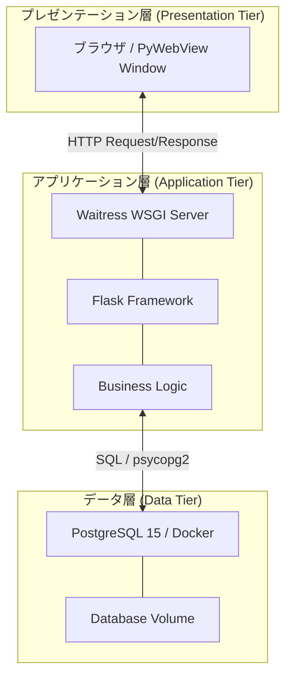
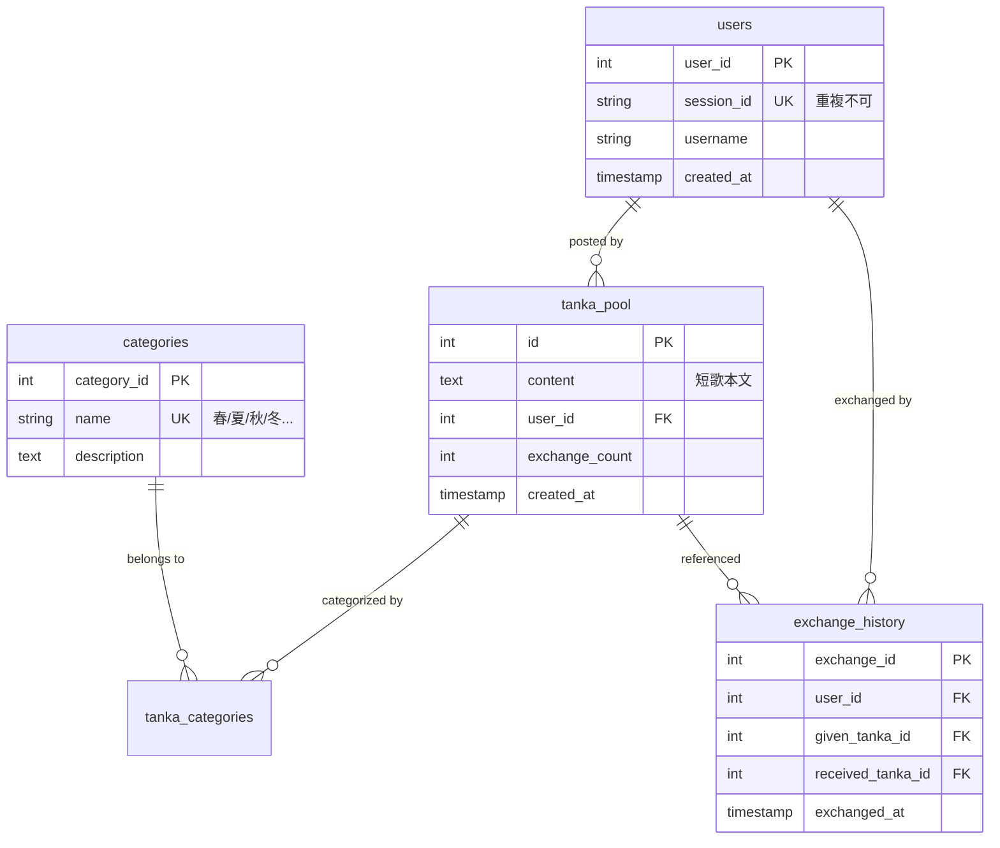
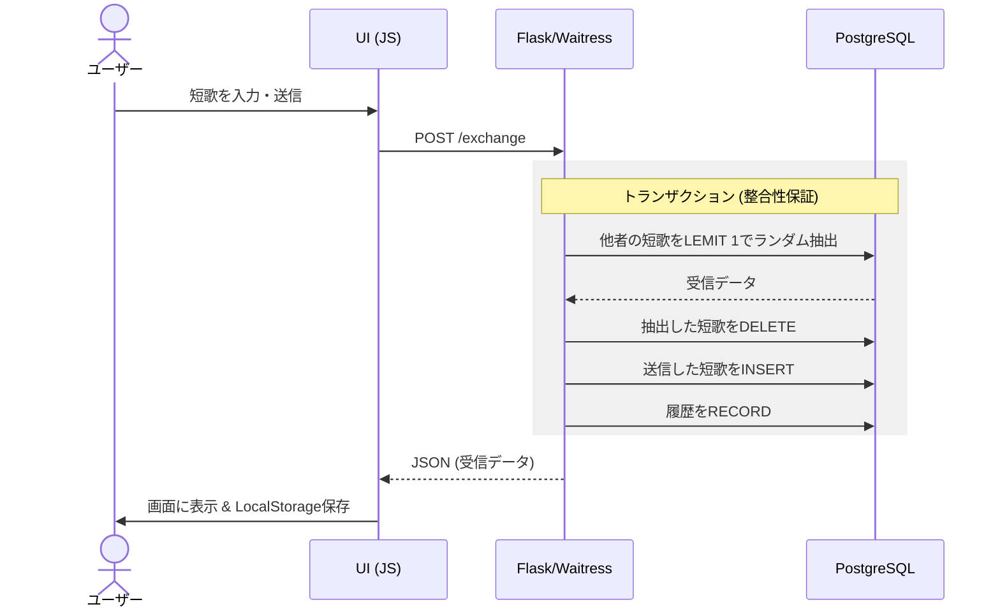

# 匿名短歌交換アプリ プレゼンテーション資料

## 1. プロジェクト概要

**「一期一会の言葉を交わす」**

- **コンセプト**: 匿名で短歌を投稿し、誰かの詠んだ短歌とランダムに交換する。
- **特徴**: 受信した短歌は DB から削除され、自分の短歌が新しく保存される。
- **こだわり**: データの流動性と、Web 3 層構造に基づいた堅牢な設計。

---

## 2. システム構成 (Web 3 層構造)

本システムは、保守性と拡張性を考慮した本格的な 3 層構造を採用しています。

- **Presentation**: ユーザーとの接点（HTML/CSS/JS/PyWebView）
- **Application**: 業務ロジックの管理（Waitress/Flask）
- **Data**: 情報の永続化と整合性担保（PostgreSQL/Docker）

---

## 3. データベース設計 (ER 図)

データの整合性を保つため、外部キー制約と正規化（第 3 回正規化レベル）を徹底しています。

- **一意性制約(UK)**: 重複登録の防止
- **外部キー(FK)**: データの不整合（ゴミデータの発生）を DB レベルで防止

---

## 4. 主要な処理フロー (シーケンス図)

最も重要な「短歌交換」の裏側では、アトミックなトランザクション処理が行われています。

---

## 5. 技術的な挑戦と解決策

1. **本番環境への対応**: 開発用サーバーではなく、**Waitress (WSGI)** を導入し、並列処理と安定性を向上。
2. **起動の自動化**: `docker-compose` の自動制御を実装し、ユーザーがコマンド一つでインフラまで起動できる環境を実現。
3. **障害への強さ**: データベースの構成不整合を自動検知して修正する「マイグレーション機能」を実装。

---

## 6. まとめ

本プロジェクトを通じて、単なるプログラミングだけでなく、エンジニアリングにおける**「3 層構造の重要性」**、**「データベースの整合性管理」**、そして**「本番環境を見据えたインフラ設計」**を深く学ぶことができました。

以上で発表を終わります。ご清聴ありがとうございました。
