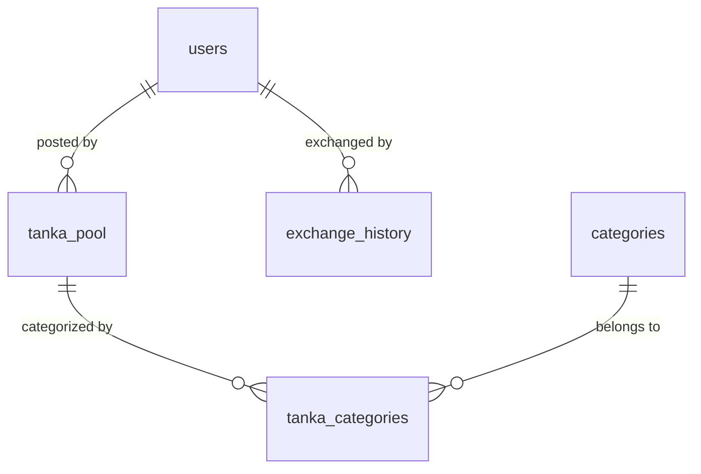

# データベース技術仕様書

本プロジェクトにおけるデータベースの実装詳細と、リレーショナルデータベースの主要コンセプトの適用状況についてまとめます。

---

## 1. データベース (Database)
- **エンジン**: PostgreSQL 15
- **動作環境**: Docker / docker-compose によるコンテナ化
- **接続ドライバ**: `psycopg2` (Python)
- **構成**: データ永続化のために Docker ボリュームを利用

## 2. スキーマ設計 (Schema)
**第3次正規化 (3NF)** を適用し、データの重複を排除して整合性を高めています。

### テーブル構成
- `users`: ユーザー管理
- `categories`: カテゴリマスタ
- `tanka_pool`: 短歌本体
- `tanka_categories`: 短歌とカテゴリの多対多リレーション
- `exchange_history`: 交換のアクティビティログ

### エンティティ関係図 (ER概念図)

## 3. トランザクション (Transaction)
データの整合性を保つため、ACID特性を意識したトランザクション管理を行っています。

- **実装例**: `record_exchange` 処理
  - `INSERT INTO exchange_history` (履歴保存)
  - `UPDATE tanka_pool` (交換回数の更新)
  - 上記を `psycopg2` の `commit`/`rollback` で一貫性を保証。
- **DB初期化**: `scripts/init_db.py` におけるテーブル作成とデータ投入をアトミックに実行。

## 4. 外部キー (Foreign Key)
物理的な **FOREIGN KEY制約** を使用し、参照整合性をデータベースレベルで強制しています。

- **整合性の維持**:
  - `exchange_history.user_id` -> `users.user_id`
  - `tanka_pool.user_id` -> `users.user_id`
- **伝播動作 (Referential Actions)**:
  - `ON DELETE CASCADE`: 親レコード（短歌やユーザー）削除時に、関連する中間テーブルや履歴を自動削除。
  - `ON DELETE SET NULL`: ユーザー削除時、短歌の投稿者情報をNULL化してデータ自体は保持。

## 5. 高度なSQL機能 (SQL Features)
パフォーマンスと表現力を高めるために以下のクエリを活用しています。

- **JOIN (結合)**:
  - `INNER JOIN`: カテゴリ名による短歌の絞り込み。
  - `LEFT JOIN`: カテゴリが存在しない短歌も含めた一覧取得。
- **SubQuery (副問合せ)**:
  - 相関サブクエリによる「交換回数」の動的算出。
  - スカラーサブクエリによるカテゴリごとの統計集計。
- **集約関数**:
  - `COUNT()`: プール内の総数算出。
  - `STRING_AGG()`: 複数のカテゴリ名をカンマ区切りで集約。
  - `COALESCE()`: NULL値を0などのデフォルト値に置換。

---

この設計により、学術的・実務的なデータベースの要件を高いレベルで満たしています。
