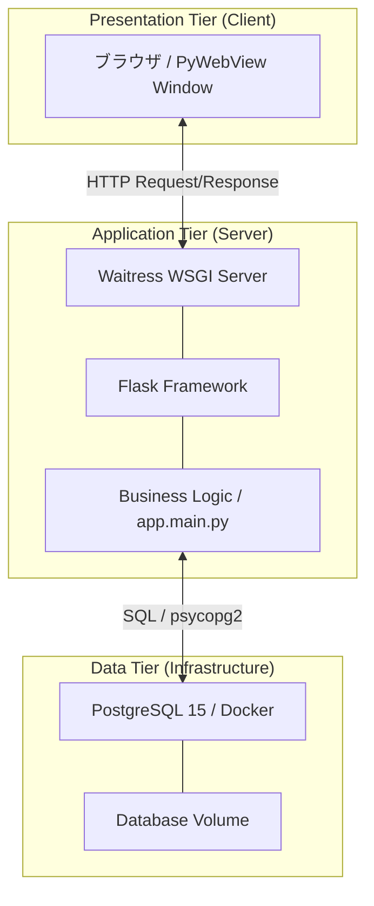
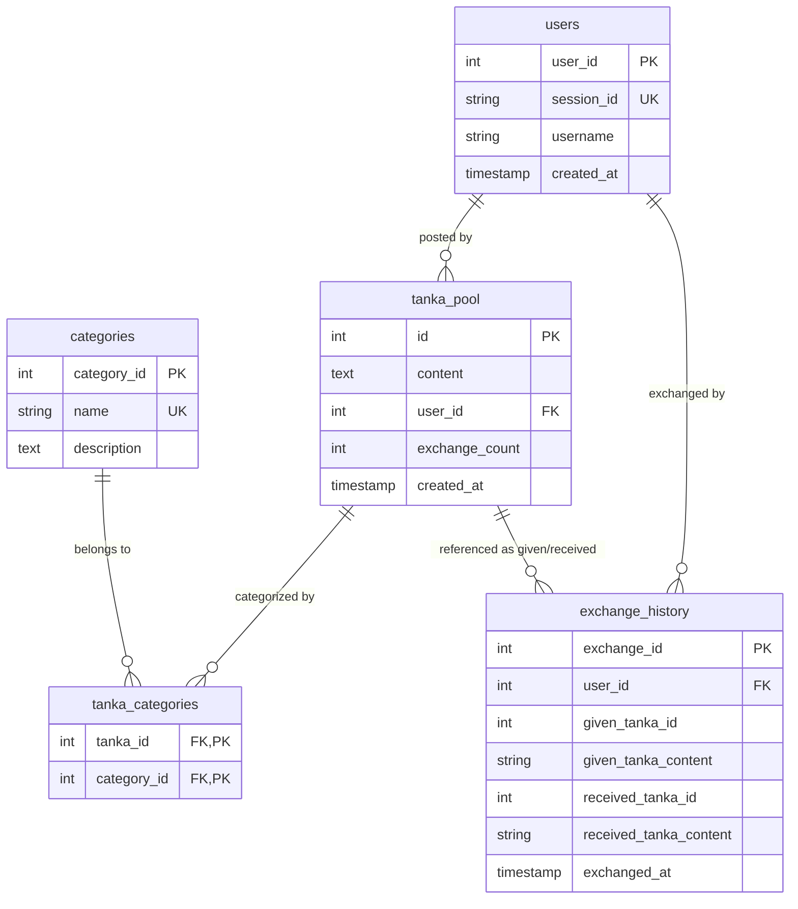

1️⃣ Persona & Motivation（顧客像と動機分析）
■ Persona（利用者像）
名前：山崎 拓海
年齢・属性：26 歳／社会人 4 年目／東京勤務
状況

満員電車と仕事のストレス

上司と部下の板挟み

コミュニケーションが苦手

誰かとつながりたいが、SNS は気疲れする

現在の課題

普通の SNS は「誰が投稿したか」で疲れる

見られる前提の投稿がしんどい

だけど、心はどこかで誰かと触れたい

ニーズ

誰にも知られず心を吐き出したい

でもただの独り言ではなく“交換”として誰かの言葉を受け取りたい

評価されない安心な場所がほしい

利用頻度

夜寝る前に静かに利用

■ Motivation Graph
Pain（痛み）
SNS は「自分の立場・キャラ・承認」が重い

誰かの反応が怖い

でも孤独はつらい

Gain（得たい価値）
匿名の安心感

「評価」ではなく「交換」

人の温かさを感じる体験

五七五七七 という優しい制約の楽しさ

Why Now？
現代の疲れた社会

“便利すぎない体験”をあえて楽しむトレンド

心の健康ニーズが高まっている

2️⃣ ストーリーボード（利用シーン）
🎬 Scene 1：1 日の終わり
拓海は布団に入り、スマホを見る。
「今日も疲れたな…でも誰かに話すほどでもない」

🎬 Scene 2：サイトを開く
ログインなし

ただ「短歌交換」ボタンがあるだけ

静かで落ち着いた世界観

🎬 Scene 3：短歌を投稿
拓海は今日の気持ちを短歌にする。

叱られて
笑顔つくって
帰り道
それでも明日
僕は歩いてる

投稿ボタンを押す。

🎬 Scene 4：短歌が届く
「交換が成立しました」

誰かからの短歌が届く

今日もまた
同じ空見て
生きている
それだけでいい
今日はそれでいい

心が少し軽くなる。

🎬 Scene 5：後からまた読める
“受け取った短歌だけ” が保存される

時々読み返して心を支える存在になる

3️⃣ UI モック（画面イメージ）
🟦 ホーム画面

---

      匿名短歌交換サイト

---

[ 短歌を交換する ]

[ 受け取った短歌を見る ]

---

## 🟦 短歌投稿画面

        あなたの短歌

---

[ 句 1：＿＿＿＿＿＿＿＿＿ ]
[ 句 2：＿＿＿＿＿＿＿＿＿ ]
[ 句 3：＿＿＿＿＿＿＿＿＿ ]
[ 句 4：＿＿＿＿＿＿＿＿＿ ]
[ 句 5：＿＿＿＿＿＿＿＿＿ ]

           [ 投稿する ]

---

※ 五七五七七は強制しない “優しい制約”
🟦 交換結果画面

---

## 交換が成立しました

あなたの短歌は誰かに届きました。
その代わりにこの短歌が届きました。

「今日もまた
同じ空見て
生きている
それだけでいい
今日はそれでいい」

---

## [ OK ]

自動的に保存されます
🟦 受信履歴

---

## 受け取った短歌

## (最新)

今日もまた
同じ空見て
生きている
それだけでいい
今日はそれでいい
[ 日付：2026/01/10 ]

---

---

## …

4️⃣ ビジネス要件定義
■ サービス提供価値
SNS ではなく “心の交換箱”

評価・競争・承認 → 一切なし

見るだけの閲覧機能もなし

自分が“受け取った短歌”だけが宝物として残る

■ 主要機能
機能 説明
匿名利用 ログイン不要・UUID 識別
短歌投稿 五七五七七想定だが強制なし
短歌交換 投稿と同時にランダム取得
受信履歴 自分が受け取った短歌のみ閲覧可
閲覧制限 他人の投稿を見られない
リアクション 完全非搭載（世界観維持）

5️⃣ システム設計 (Technical Design)
■ システム構成図 (Web 3 層構造)

■ 実体関連図 (ER Diagram - 3NF)

6️⃣ 今後の展望：MCP による AI 合体型システム
■ 追加機能：「AI 専属歌人」による創作支援

- **ターゲット**: 「気持ちはあるが、短歌にするのが苦手」なユーザー。
- **仕組み**: **MCP (Model Context Protocol)** を導入し、AI がデータベース（過去の短歌プール）を学習・参照しながら、ユーザーと対話して短歌作りをサポートします。
- **価値**: 誰にも言えない悩みを聞いてくれる「AI カウンセラー」と、表現を助ける「創作パートナー」の二役を担います。
